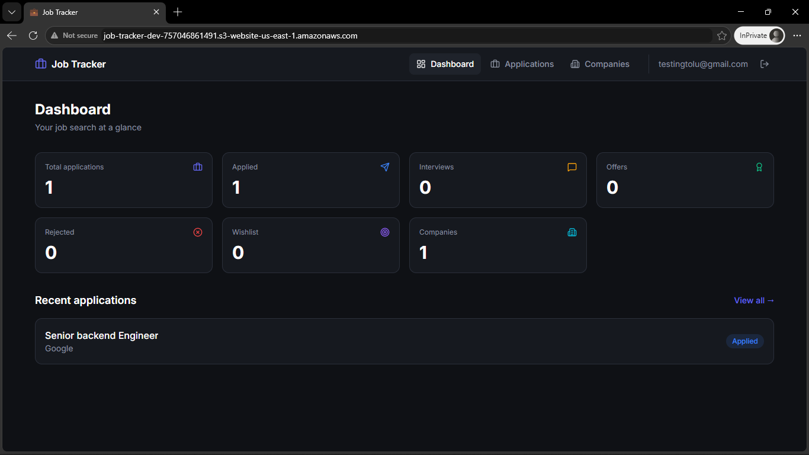
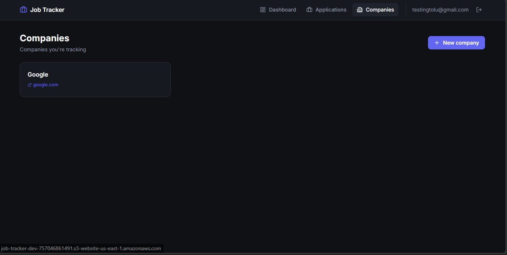
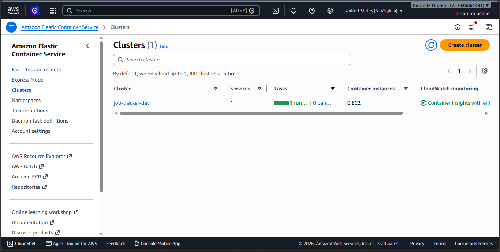

# Job Application Tracker

A full-stack job application tracker: FastAPI backend + React frontend, deployed
to AWS ECS Fargate via Terraform.

**🔴 Live demo:** http://job-tracker-dev-757046861491.s3-website-us-east-1.amazonaws.com
*(Deployed intermittently to control costs — if down, spin it up yourself with the instructions below.)*

## Screenshots

| Dashboard | Kanban Board |
|---|---|
|  |  |

| Companies | AWS ECS |
|---|---|
|  |  |

## Architecture
┌─────────────────────────────────────────────────────┐
Browser ────────▶│ S3 (React) ──fetch──▶ ALB ──▶ ECS Fargate ──▶ RDS │
│ Postgres│
└─────────────────────────────────────────────────────┘
AWS (us-east-1)

text

- **VPC**: 2 AZs, public + private subnets, Internet Gateway + NAT
- **ALB**: public, routes to ECS tasks in private subnets
- **ECS Fargate**: FastAPI container, single task (autoscaling ready)
- **RDS Postgres 16**: db.t4g.micro, private subnets, encrypted at rest
- **Secrets Manager**: DB credentials + JWT signing key
- **ECR**: private Docker registry
- **S3**: hosts React static build
- **CloudWatch**: container logs with 7-day retention

## Tech Stack

| Layer | Technology |
|---|---|
| Backend | FastAPI, SQLAlchemy 2.0, Pydantic v2, JWT auth |
| Frontend | React 19, Vite, Tailwind CSS v4, TanStack Query, dnd-kit |
| Database | PostgreSQL 16 |
| Container | Docker (multi-stage build) |
| Infrastructure | Terraform (~55 AWS resources) |
| Cloud | AWS ECS Fargate, RDS, ALB, VPC, ECR, S3, Secrets Manager |

## Features

- 🔐 JWT authentication (register, login, `/me`)
- 🏢 Company management
- 📋 Applications tracked with status (wishlist, applied, interview, offer, rejected)
- 🎤 Interview scheduling per application
- 🎯 Drag-and-drop kanban board
- 📊 Live dashboard with stats
- 🔒 Strict ownership isolation (users can't see each other's data)

## Local Development

Requires Docker and Docker Compose.

```bash
docker compose up --build
# Backend at http://localhost:8000/docs
# Frontend at http://localhost:5173 (npm run dev in frontend/)
Deploying to AWS
Prerequisites
AWS account with programmatic access

Terraform ≥ 1.5

Docker

Steps
bash
# 1. Bootstrap Terraform backend (once)
cd terraform/bootstrap && terraform init && terraform apply

# 2. Configure dev environment
cd ../environments/dev
# Edit backend.tf with your state bucket name

# 3. Create infrastructure
terraform init && terraform apply

# 4. Build and push Docker image
cd ../../../backend
export ECR_URL=$(cd ../terraform/environments/dev && terraform output -raw ecr_repository_url)
docker build --platform linux/amd64 -t job-tracker .
docker tag job-tracker:latest $ECR_URL:latest
aws ecr get-login-password --region us-east-1 | docker login --username AWS --password-stdin $ECR_URL
docker push $ECR_URL:latest

# 5. Build and deploy frontend
cd ../frontend
npm install && npm run build
cd ../terraform/environments/dev && terraform apply

# 6. Scale up ECS service
sed -i 's/desired_count = 0/desired_count = 1/' main.tf
terraform apply
Design Decisions
Two IAM roles for ECS — task execution role (pull image, read secrets, write logs) is separate from task role (what the app does at runtime). Principle of least privilege.

Runtime config injection — window.__API_URL__ set via S3-hosted config.js, so the same Docker image and frontend bundle work in any environment without rebuilding.

Single NAT Gateway — cost optimization for dev. Production would use one per AZ for HA.

DynamoDB for Terraform state locking — prevents concurrent applies from corrupting state.

Secrets Manager for DB credentials — never in env vars, IAM-scoped, auditable.

ignore_changes = [desired_count] on ECS service — allows autoscaling to adjust without Terraform fighting it.

What I Learned
Building a production VPC from scratch (subnets, route tables, NAT, IGW)

ECS Fargate task definitions, services, and target group integration

Runtime vs build-time configuration for SPA deployments

Terraform module dependency cycles and how to break them

Debugging CORS + cached config in a deployed SPA

Cost/HA trade-offs (single NAT, single-AZ RDS in dev)

License
MIT
